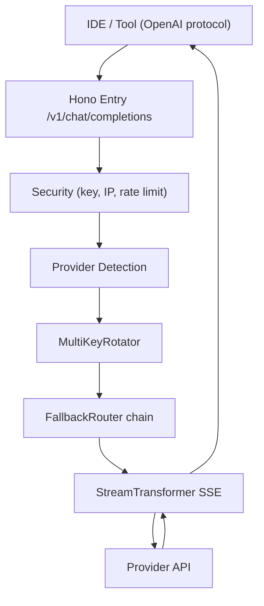
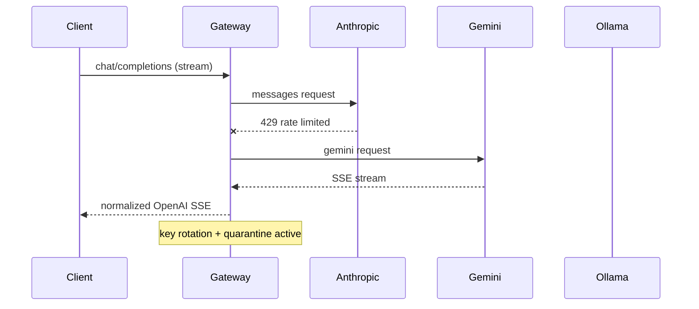

# 9898048483 Adapter OS v10.0 — Universal AI Gateway & Cross-Platform Suite

Transform **any** AI provider API into a unified, standard **OpenAI-compatible** endpoint.

One gateway, zero-config everywhere: VS Code (Continue.dev, GitHub Copilot BYOK), Android Studio,
JetBrains, Cursor AI, Obsidian, Chatbox, Zed, and native mobile/desktop clients.

```text
                         ┌─────────────────────────────────────────────┐
   OpenAI-compatible     │         9898048483 Adapter OS v10.0         │
   /v1/chat/completions  │                                             │
   /v1/models            │  ┌──────────────┐  ┌───────────────────┐   │
                         │  │ Key Rotator  │  │ Fallback Router   │   │
  VS Code ───────────────┼─▶│ (round-robin)├─▶│ (auto failover)   │───┼──▶ Anthropic Claude
  Cursor / Zed           │  └──────────────┘  └─────────┬─────────┘   │──▶ Google Gemini
  JetBrains / Android    │                              │             │──▶ DeepSeek R1/V3
  Obsidian / Chatbox     │                    Stream Transformer       │──▶ OpenAI GPT-4o
  Mobile / Desktop       │                  (SSE normalization)       │──▶ Ollama / vLLM
                         │                                             │──▶ Groq / OpenRouter
                         └─────────────────────────────────────────────┘──▶ Mistral / Cohere
```

## Features

- **Protocol translators** for Anthropic, Gemini, DeepSeek, OpenAI, Ollama/vLLM, Groq, OpenRouter, Mistral, Cohere
- **SSE streaming engine** that normalizes every provider's stream into OpenAI `text/event-stream`
- **Multi-key round-robin rotator** per provider to spread load and bypass rate limits
- **Automatic fallback chain** — Claude fails, traffic auto-routes Gemini → DeepSeek → Ollama
- **Security**: optional gateway key auth, IP allowlist, per-IP rate limiting
- **Observability**: Prometheus `/metrics`, live request log at `/v1/logs`, `/health`
- **Tauri v2 + React GUI**: Chat Studio, Gateway Control Center, IDE config generator, encrypted Key Vault
- **Deploy anywhere**: Docker, Vercel, Render, Cloudflare Workers, Windows/macOS/Linux/Android native

## Quick Start (Backend Gateway)

### Prerequisites

- [Bun](https://bun.sh) `>= 1.1` (recommended) or Node `>= 20`
- Provider API keys (optional — the gateway runs without any, it just needs keys to proxy)

### Run

```bash
# 1. Install dependencies
npm install

# 2. Configure keys
cp .env.example .env
#    edit .env and paste your provider keys

# 3. Start the gateway
npm run dev        # Bun (watch mode)
# or
npm run start:node # Node via tsx
```

```text
[adapter-os] Universal AI Gateway v10.0 listening on http://0.0.0.0:8787
[adapter-os] Endpoints: GET /v1/models | POST /v1/chat/completions | GET /health | GET /metrics
```

### Smoke test

```bash
curl http://localhost:8787/v1/models

curl -X POST http://localhost:8787/v1/chat/completions \
  -H 'content-type: application/json' \
  -d '{"model":"claude-3-5-sonnet-20241022","messages":[{"role":"user","content":"Hello!"}]}'
```

## Provider Configuration

Keys are read from `.env`. **Comma-separated keys are rotated round-robin** per provider:

```env
ANTHROPIC_API_KEY=key1,key2,key3   # load-balances across all three
GEMINI_API_KEY=keyA
DEEPSEEK_API_KEY=...
```

| Provider   | Env key               | Base URL (override)          | Native protocol |
| ---------- | --------------------- | ---------------------------- | --------------- |
| Anthropic  | `ANTHROPIC_API_KEY`   | `https://api.anthropic.com`  | Messages API    |
| Gemini     | `GEMINI_API_KEY`      | `generativelanguage...`      | generateContent |
| OpenAI     | `OPENAI_API_KEY`      | `https://api.openai.com/v1`  | OpenAI          |
| DeepSeek   | `DEEPSEEK_API_KEY`    | `https://api.deepseek.com`   | OpenAI          |
| Ollama     | `OLLAMA_API_KEY`      | `http://localhost:11434`     | Ollama chat     |
| vLLM       | `VLLM_API_KEY`        | `http://localhost:8000`      | OpenAI          |
| Groq       | `GROQ_API_KEY`        | `https://api.groq.com/openai/v1` | OpenAI      |
| OpenRouter | `OPENROUTER_API_KEY`  | `https://openrouter.ai/api/v1` | OpenAI        |
| Mistral    | `MISTRAL_API_KEY`     | `https://api.mistral.ai/v1`  | OpenAI          |
| Cohere     | `COHERE_API_KEY`      | `https://api.cohere.com/v2`  | OpenAI          |

### Routing rules

1. **Model name** auto-detects the provider (`claude-*` → Anthropic, `gemini-*` → Gemini, etc.)
2. **`x-provider` header** overrides detection (`x-provider: ollama`)
3. **`x-custom-endpoint` header** overrides the provider base URL (point it at a LAN Ollama/vLLM)
4. **`x-fallback` header** sets the per-request fallback chain (`x-fallback: anthropic,gemini,openrouter`)

### Request-time key injection

Send `Authorization: Bearer <key>` or `x-api-key: <key>` on any request to use that key for the
session instead of the server-configured key — ideal for per-user billing on a shared gateway.

## Fallback Engine

When a provider returns 4xx/5xx, times out, or rate-limits, the gateway automatically retries the
chain `FALLBACK_CHAIN` (default `anthropic,gemini,deepseek,openrouter,ollama`). Failed providers are
quarantined for 30s and skipped. Watch it live:

```bash
curl http://localhost:8787/metrics   # adapter_fallback_events_total
curl http://localhost:8787/v1/logs   # attempt column shows the chain position
```

## Streaming

```bash
curl -N -X POST http://localhost:8787/v1/chat/completions \
  -H 'content-type: application/json' \
  -d '{"model":"gemini-2.0-flash-exp","messages":[{"role":"user","content":"Count to 5"}],"stream":true}'
```

Every provider's stream (Anthropic `content_block_delta`, Gemini `candidates`, OpenAI passthrough)
is normalized to OpenAI SSE chunks with `data: {chunk}\n\n` and a final `data: [DONE]`. DeepSeek
`reasoner` models expose their `<think>` trace as `delta.reasoning_content`.

## Desktop GUI (Tauri v2)

The `gui/` directory contains the cross-platform native app: **Matrix Neon / Cyberpunk Dark** UI.

### Develop

```bash
cd gui
npm install
npm run tauri dev
```

In the desktop app, use the **ENDPOINT** button in the top-right to point at any gateway
(`http://localhost:8787`, a LAN IP, or a deployed remote). The URL is persisted locally; leave it
empty to use the Vite dev proxy. This makes the packaged desktop/mobile app work against local,
LAN, or cloud gateways without recompiling.

### Build native bundles

```bash
npm run tauri build            # produces platform bundle in gui/src-tauri/target/release/bundle
npm run tauri android build    # Android APK (after `npm run tauri android init`)
```

The bundled app targets: **Windows NSIS .exe**, **macOS .dmg**, **Linux .AppImage/.deb/.rpm**, **Android .apk**.

### GUI tabs

| Tab                  | What it does                                                        |
| -------------------- | ------------------------------------------------------------------- |
| Chat Studio          | Markdown + syntax-highlighted streaming chat across any model       |
| Gateway Control      | Live latency, request log, provider health toggles, model catalog   |
| IDE Guide            | 1-click copy configs for VS Code, Cursor, JetBrains, Android Studio, Obsidian, Chatbox, Zed |
| Key Vault            | Locally encrypted keys (AES-256-GCM, PBKDF2). Unlocked keys are automatically sent as `Authorization: Bearer <key>` to the gateway for the matching provider (per-request key injection), which takes precedence over server env keys |
| Pro Hub              | Official support resources: WhatsApp consultation, donation system, and digital store catalog |

Security note: vault keys are decrypted only in-memory after your passphrase unlock, and are sent
to whichever gateway URL you configure in the **ENDPOINT** setting — use that only with gateways
you trust.

## Deployment

### Docker

```bash
cp .env.example .env      # fill in keys
docker compose up -d      # gateway on :8787
# or
docker build -t adapter-os . && docker run -p 8787:8787 --env-file .env adapter-os
```

### Cloudflare Workers

```bash
npm i -g wrangler
wrangler secret put ANTHROPIC_API_KEY
wrangler secret put GEMINI_API_KEY
wrangler deploy
```

### Vercel / Render

- **Vercel**: connect the repo in the Vercel dashboard (import). `vercel.json` and `api/index.ts`
  wire every route to the gateway as a serverless function. Add your `*_API_KEY` env vars in the
  project settings. Local dev: `npx vercel dev`.
- **Render**: use the bundled `render.yaml` blueprint — create a New Blueprint from the repo and
  it provisions the service automatically. It runs `npm install && npm run build`, starts
  `npm run start:node`, and health-checks `/health`. Fill in the `sync: false` secret keys in the
  dashboard.

### GitHub Actions

Tag a release to auto-compile every platform bundle:

```bash
git tag v10.0.0 && git push origin v10.0.0
```

The `.github/workflows/build-apps.yml` pipeline builds Windows .exe, macOS .dmg, Linux .AppImage/.deb,
and Android .apk, then attaches them to the GitHub Release. A `workflow_dispatch` input lets you pick
a single platform.

## Project Layout

```text
.
├── src/                          # Hono backend (Bun / Node / Workers)
│   ├── index.ts                  # master entry: routes, security, streaming
│   ├── config.ts                 # provider registry + env config
│   ├── types.ts                  # shared types
│   ├── adapters/
│   │   └── stream-transformer.ts # universal SSE converter
│   └── middleware/
│       ├── key-rotator.ts        # multi-key round-robin + quarantine
│       └── fallback-router.ts    # auto-failover chain
├── api/index.ts                  # Vercel serverless entry
├── gui/                          # Tauri v2 + React + Tailwind app
│   ├── src/App.tsx               # tab navigation + state
│   ├── src/components/           # ChatStudio, GatewayDashboard, IDEConfigurator, KeyVault
│   └── src-tauri/                # tauri.conf.json, Rust shell, icons
├── Dockerfile                    # multi-arch Bun image (3-stage, slim runtime)
├── docker-compose.yml            # gateway (+ optional Ollama sidecar)
├── .dockerignore
├── vercel.json                   # one-click Vercel deployment
├── render.yaml                   # Render blueprint (free tier ready)
├── wrangler.toml                 # Cloudflare Workers config
└── .github/workflows/build-apps.yml  # CI + Windows/macOS/Linux/Android release matrix
```

## Architecture





## API Reference

### `GET /v1/models`

Aggregated model catalog across all providers.

### `GET /v1/models/:id`

Single-model lookup (404 if unknown).

### `POST /v1/chat/completions`

OpenAI-compatible body. Request headers: `Authorization` / `x-api-key`, `x-provider`,
`x-custom-endpoint`, `x-fallback`.

### `POST /v1/embeddings`

OpenAI-compatible embeddings passthrough (`{ model, input }`) with key rotation — used by Copilot
BYOK and RAG pipelines. Supported: OpenAI, Mistral, Cohere, vLLM and other OpenAI-compatible
`/embeddings` providers (select via `x-provider`).

### `GET /health`, `GET /metrics`, `GET /v1/logs`

Health, Prometheus counters, and the last 50 gateway requests.

## Security Notes

- Set `REQUIRE_GATEWAY_KEY=true` and a strong `GATEWAY_API_KEY` before exposing publicly.
- Use `IP_ALLOWLIST` for private deployments.
- Provider keys live in the server `.env` (or the GUI Key Vault, encrypted at rest in the browser).
- Key Vault uses AES-256-GCM with a PBKDF2-derived key; the passphrase never leaves the device.

## License

MIT — see [LICENSE](./LICENSE).
